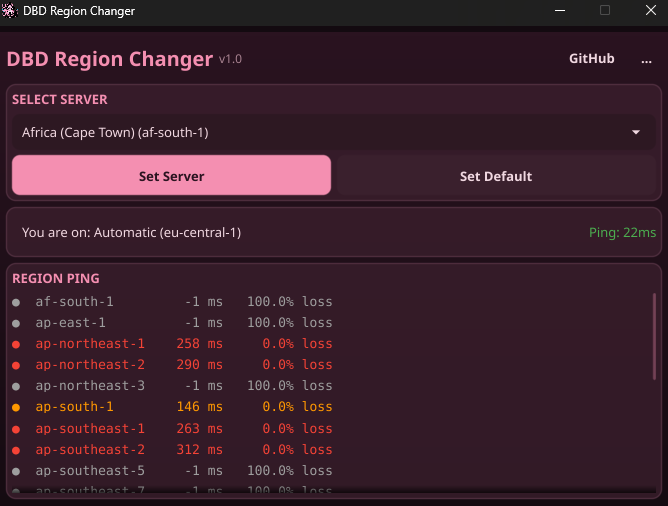

<p align="center">
  
</p>

<p align="center">
  <a href="https://github.com/y0f/dbd-region-changer/actions/workflows/ci.yml"></a>
  <a href="https://goreportcard.com/report/github.com/y0f/dbd-region-changer"></a>
  <a href="https://github.com/y0f/dbd-region-changer/blob/main/go.mod"></a>
  <a href="LICENSE"></a>
  <a href="https://github.com/y0f/dbd-region-changer/releases/latest"></a>
</p>

---

## what it does

small desktop app that forces dead by daylight onto the aws region you pick. it blocks the game
from reaching every other region's gamelift ping beacon (windows firewall, scoped to the dbd exe;
iptables on linux), so the only region it can measure and match into is the one you chose. handy
if you want to play on another region's servers. windows and linux (proton's fine).

> close dbd before you change region, and launch it after. changing while it's running can flag
> easy anti-cheat, so do it with the game closed.

<p align="center">
  
</p>

## getting it

binaries are on the [releases](https://github.com/y0f/dbd-region-changer/releases/latest) page.
single file, no installer.

## using it

1. close dbd.
2. run the app (windows: accept the admin prompt; linux: it asks for your password via pkexec when
   it changes the firewall).
3. pick a region, hit **set server** (windows auto-finds the dbd exe via steam; if it can't, use
   the `...` menu -> set dbd path).
4. launch dbd.

on windows the block auto-refreshes so it stays locked between matches. **set default** removes
the firewall rules and goes back to normal matchmaking. the ping bars show latency per region.

## regions

hong kong, tokyo, seoul, mumbai, singapore, sydney, canada central, frankfurt, dublin, london,
sao paulo, n. virginia, ohio, n. california, oregon.

## if it fails to apply

it needs admin to add firewall rules. if set server errors, accept the elevation prompt; on
windows, make sure controlled folder access / your antivirus isn't blocking it, and that dbd is
fully closed. each release ships a sha256 checksum.

## building

go 1.26+ and a c toolchain (the gui uses cgo + opengl).

```bash
# windows (mingw on PATH)
export PATH="/c/msys64/mingw64/bin:$PATH" CGO_ENABLED=1
go build -ldflags='-s -w' -trimpath -o dist/dbdregion.exe ./cmd/dbd

# linux (apt install libgl1-mesa-dev xorg-dev libxkbcommon-dev)
CGO_ENABLED=1 go build -ldflags='-s -w' -trimpath -o dist/dbdregion ./cmd/dbd
```

tests: `bash scripts/test.sh`. to sanity-check the linux build from windows:
`./scripts/linux-test.ps1` (runs it in docker).

## how it works

dbd runs on aws gamelift. the client picks a region by pinging each region's udp ping beacon
(`gamelift-ping.<region>.api.aws:7770`) and reporting the latencies to matchmaking. the app
resolves those beacon ips and firewall-blocks all of them except your chosen region, scoped to the
dbd exe, so the game can only measure (and therefore match into) the region you picked. nothing is
intercepted and no game files are touched. if no firewall backend is available it falls back to a
hosts-file edit redirect.

## license

[gpl-3.0](LICENSE).
